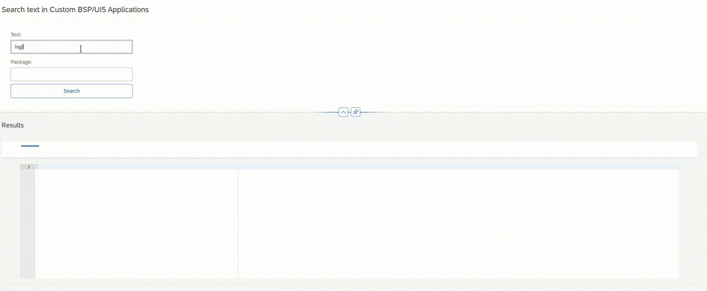

Finding where a specific OData service or code snippet is used within deployed UI5 applications can sometimes be problematic. Standard ABAP search tools (like `RS_ABAP_SOURCE_SCAN`) fall short here because they cannot scan the contents of UI5 source code.

To address this, a simple tool was created that allows for text-based searching within UI5 applications on the system.

**What the Tool Does:**

- **Compatibility:** Works with EHP8 and the Fiori interface.
- **Function:** Searches for specific text (e.g., an OData service name) on a package basis or across applications.
- **Result:** Lists exactly which file and application the search term appears in.

I am sharing this project in case anyone else has a similar need. After installation, you might need to make small OData configurations depending on your environment. If you spot any bugs or want to improve it, feel free to open an issue or comment on GitHub.

**GitHub Link:** [github.com/yunus-tuzun](https://github.com/yunus-tuzun)
