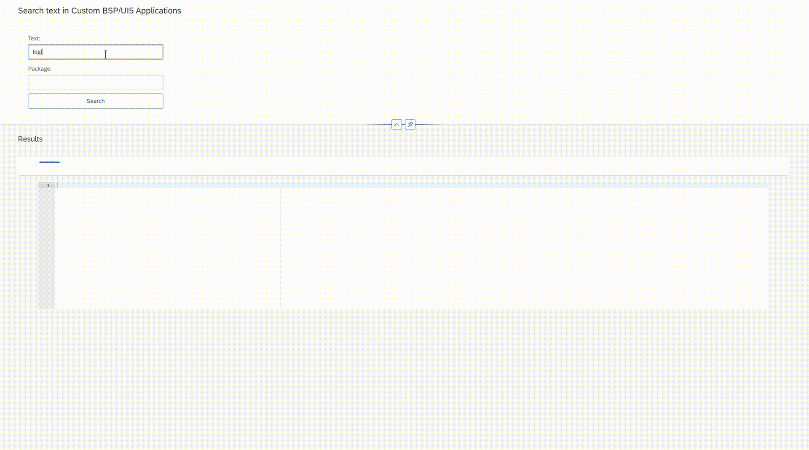

Deploy edilmiş UI5 uygulamaları içerisinde belirli bir OData servisinin veya kod parçasının nerede geçtiğini bulmak bazen uğraştırıcı olabiliyor. Standart ABAP arama araçları (`RS_ABAP_SOURCE_SCAN` vb.) UI5 kaynak kodlarının içeriğini tarayamadığı için bu konuda yetersiz kalıyor.

Bu eksikliği gidermek adına, sistemdeki UI5 uygulamaları içerisinde metin bazlı arama yapabilen basit bir araç hazırlandı.

**Özetle Araç Ne Yapıyor?**

- **Uyumluluk:** EHP8 ve Fiori arayüzü ile çalışıyor.
- **İşlev:** Paket bazında veya tüm uygulamalarda belirli bir metni (örneğin bir OData servisi ismini) arıyor.
- **Sonuç:** Aranan ifadenin hangi uygulamanın hangi dosyasında geçtiğini listeliyor.

Benzer bir ihtiyaç duyanlar olursa diye projeyi paylaşıyorum. Kurulum sonrası ortamınıza göre ufak OData ayarları yapmanız gerekebilir. Hata görürseniz veya geliştirmek isterseniz GitHub üzerinden yazabilirsiniz.

**GitHub Linki:** [github.com/yunus-tuzun](https://github.com/yunus-tuzun)
